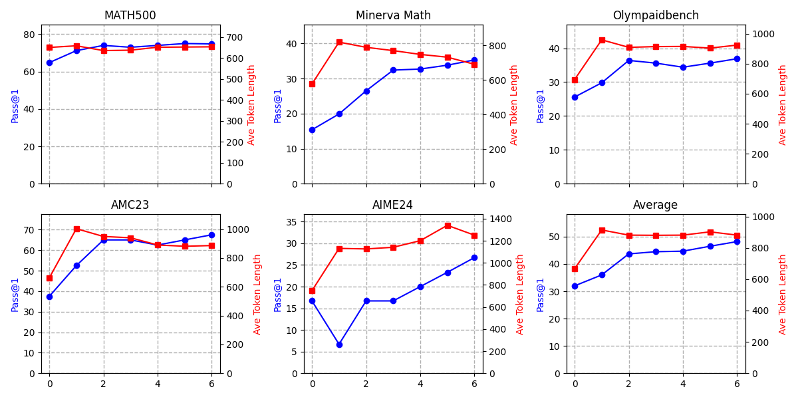
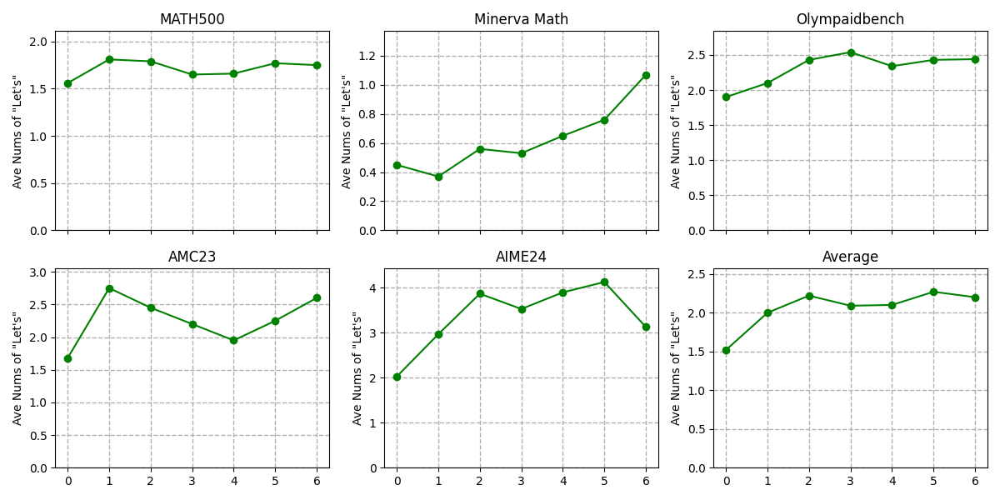

<div align="center">

# Improving Math Reasoning through Direct Preference Optimization with Verifiable Pairs


</div>

**TL;DR:** We enhance the mathematical reasoning ability of LLMs solely through Verifiable Reward filtering and the self-improvement training paradigm of DPO. The final model, Qwen2.5-7B-DPO-VP, demonstrates mathematical reasoning capabilities comparable to current RL-based approaches. The entire framework does not require model parallelism, enabling replication on a single A800 GPU.

## 🎉 News:

- [2025/02/18] We released the simple technical report, code, and the [Huggingface model](https://huggingface.co/SunnyLin/Qwen2.5-7B-DPO-VP).

## 📖 Introduction

Since 2025, reinforcement learning fine-tuning (ReFT) based on Verifiable Reward (VR) has been shown to significantly enhance the mathematical reasoning abilities of sufficiently capable base models. Examples include works like [DeepSeek R1](https://github.com/deepseek-ai/DeepSeek-R1), [SimpleRL-Zero](https://github.com/hkust-nlp/simpleRL-reason), and [PURE](https://github.com/CJReinforce/PURE). These methods, based on RL algorithms like PPO or GRPO, still require substantial computational resources, ranging from 8 to dozens of A100 GPUs. Our goal is to enhance the mathematical reasoning abilities of LLMs using the same base models, but with more limited computational resources and without relying on external distillation.

Essentially, works like Direct Preference Optimization ([DPO](https://arxiv.org/abs/2305.18290)) align with the optimization objectives of RL, aiming to refine the generation distribution of LLMs to favor accepted answers and reject incorrect ones within a given dataset. In [DeepSeek R1](https://github.com/deepseek-ai/DeepSeek-R1), we observed that Verifiable Reward is a 0/1 discrete variable, representing whether the output meets predefined correctness criteria. This is similar to the original design of DPO, where correct samples are classified as positive and incorrect ones as negative, thereby constructing Verifiable Pairs to optimize the model.

However, DPO is a purely offline optimization algorithm and does not satisfy the need for self-improvement in models. Drawing on the ideas from [Iterative DPO](https://arxiv.org/abs/2305.18290), we propose a self-improvement process based on the Qwen2.5-Math-7B base model. In this process, we perform sampling-filtering to construct preference datasets for self-improvement using a challenging 8K MATH dataset (same as [SimpleRL-Zero](https://github.com/hkust-nlp/simpleRL-reason) and [PURE](https://github.com/CJReinforce/PURE)), as outlined below:

- In each round of sampling, we select 8 samples for each prompt and filter out one pair of samples to construct the current preference dataset:
  - *Score each answer:* Following the VR scoring method, assign 1 if the answer is correct and formatted, 0 if incorrect but formatted, and -1 if the answer is not in the correct format regardless of correctness.
  - *Positive sample:* If there is a sample with a score of 1, select the one with the longest token length as the positive sample. If there is no score of 1 but there are samples with a score of 0, select the longest 0-score sample as the positive sample. Otherwise, skip the prompt.
  - *Negative sample:* If there is a sample with a score of -1, randomly select one as the negative sample. If there are no -1 samples but there are 0-score samples, randomly select one as the negative sample. Otherwise, skip the prompt.
- After constructing the dataset, perform one epoch of DPO iteration to train the model, and then repeat the process based on the newly trained model.

After fine-tuning, we conducted 6 rounds of DPO iterations, incorporating a temperature-based sampling strategy to increase data diversity: In the first 3 rounds, we set the temperature coefficient to 0.7 for sampling; in rounds 4-5, we set it to 1.0; and in the final round, we set it to 1.2.

### Training Costs
Sampling and training were performed on 4 A800 GPUs, with DPO implementing only data parallelism. In theory, training can be done on a single 80GB GPU or even lower configurations. In our 4-GPU experiment, each round of sampling took approximately 2-2.5 hours, and each round of training took about 1 hour. Therefore, the entire process took about 80 hours on A800, and on a single GPU, it would take approximately 3 days to replicate.

### Final Results
The final model achieved an average score of 48.2 on five mathematical reasoning benchmarks, which is comparable to the performance of Qwen2.5-Math-7B-Instruct and other RL-based methods with similar RL data conditions.


***All results are in pass@1 accuracy***

|*pass@1 acc*| MATH500 | Minerva Math | Olymapaidbench   | AMC23 | AIME24 | Avg.   |
| -------------------------- | --------- | -------- | -------- | ------------ | ------------- | -------- |
| [Qwen2.5-Math-7B](https://huggingface.co/Qwen/Qwen2.5-Math-7B) *         | 64.8      | 15.4     | 25.6     | 37.5         | 16.7          | 32.0     |
| [Qwen2.5-Math-7B-Instruct](https://huggingface.co/Qwen/Qwen2.5-Math-7B-Instruct) *| 83.2      | 33.5     | 38.4     | 62.5         | 20.0          | 47.5     |
| [rStar-Math-7B](https://arxiv.org/abs/2501.04519) ^       | 78.4      | -     | 47.1     | 47.5         | 26.7          | -     |
| [Eurus-2-7B-PRIME](https://huggingface.co/PRIME-RL/Eurus-2-7B-PRIME) *        | 74.0      | 39.7     | 35.6     | 57.5         | 23.3          | 46.0     |
| **[Qwen2.5-7B-Simple-RL-Zero](https://github.com/hkust-nlp/simpleRL-reason)** ^   | 77.2      | 33.5     | 37.6     | 62.5         | 33.3          | 48.8     |
| **[Qwen2.5-7B-Simple-RL-Zero](https://huggingface.co/Bradley/Qwen-2.5-7B-Simple-RL)** *   | 75.6      | 34.2     | 39.0     | 52.5         | 26.7          | 45.6     |
| **[Qwen2.5-7B-PURE-VR](https://huggingface.co/jinachris/PURE-VR)** *    | 79.8      | 36.8     | 41.9     | 60.0         | 20.0          | 47.7     |
| **Qwen2.5-7B-DPO-VP**    |   74.8   | 35.3 | 36.9 | 67.5 | 26.7 | 48.2|

In the table, all models are fine-tuned based on the Qwen2.5-Math-7B base model. Bolded models represent those that were adjusted using the self-improvement method with exactly the same prompts. The results with * are from my own evaluation, and the results with ^ are derived from the corresponding model's technical report. Note that Qwen2.5-7B-Simple-RL-Zero has not released its trained model, so we evaluated a reproduced version found on Huggingface. Additionally, we observed that due to Qwen's official evaluation code slicing the model, slight differences may arise when evaluating on different numbers of GPUs. Our model and the reproduced results were both evaluated on 4 A800 GPUs.

***Data and GPUs comparison of different approaches***


|                | Qwen2.5-Math-7B-Instruct        | rStar-Math-7B                  | Eurus-2-7B-PRIME         | Qwen2.5-7B-SimpleRL-Zero | Qwen2.5-7B-PURE-VR         | Qwen2.5-7B-DPO-VP         |
| -------------- | ------------------------------- | ------------------------------ | ------------------------ | ------------------------ | ----------------------- | ----------------------- |
| **Base Model** | Qwen2.5-Math-7B                 | Qwen2.5-Math-7B                | Qwen2.5-Math-7B          | Qwen2.5-Math-7B          | Qwen2.5-Math-7B         | Qwen2.5-Math-7B         |
| **SFT Data**   | 2.5M (open-source and in-house) | ~7.3M (MATH, NuminaMath, etc.) | 230K                     | 0                        | 0                       | 0 |
| **RM Data**    | 618K (in-house)                 | ~7k (in-house)                 | 0                        | 0                        | 0      | 0|
| **RM**         | Qwen2.5-Math-RM (72B)           | None                           | Eurus-2-7B-SFT           | None                     | None  | None |
| **Self-improve Method**    | RL + ORM     | MCTS + PPM       | RL + PRM|  RL + VR   | RL + VR   | DPO + VR
| **Self-improve Data**    | 66K     | ~3.647M                    | 150K| 8K   | 8K   | 8K
| **GPUs**       | -                               | 80 H100 at most                | 8 A100                   | 40 H100                  | 8 A100                  | 1 A800 or even less


***Accuracy and Token Length***

We plotted the accuracy of the iterative process across various datasets against the average token length of the datasets. We observed a consistent increase in accuracy, while the token length for inference did not exhibit an initial rise followed by a decline; instead, it remained relatively stable within a consistent range.



When comparing several different models, the output lengths were approximately equivalent.

| *Avg. Token Length*                  | MATH500 | Minerva Math | Olymapaidbench | AMC23 | AIME24 | Avg. |
|-----------------------------|---------|--------------|----------------|-------|--------|---------|
| Qwen2.5-Math-7B*            | 651     | 577          | 695            | 662   | 748    | 667     |
| Qwen2.5-Math-7B-Instruct*   | 641     | 650          | 886            | 911   | 1164   | 850     |
| Eurus-2-7B-PRIME*           | 655     | 822          | 897            | 1020  | 1164   | 912     |
| Qwen2.5-7B-Simple-RL*       | 588     | 775          | 801            | 767   | 952    | 777     |
| Qwen2.5-7B-PURE-VR*         | 626     | 646          | 863            | 850   | 1050   | 807     |
| **Qwen2.5-7B-DPO-VP**          | 654     | 691          | 924            | 886   | 1251   | 881     |


***Aha Moment***

We did not observe a significant Aha Moment, which aligns with the findings of [PURE](https://github.com/CJReinforce/PURE).  We observed that even when using CoT prompts, Qwen-math still attempts to solve problems using Python code in many instances, although it does not actually execute the code. Additionally, we noticed a re-evaluation phenomenon in the model's responses, such as "Let's re-evaluate ..."; this was already evident in Qwen2.5-math-7B-base, leading us to conclude that DPO does not enable the base model to spontaneously develop self-evaluation capabilities. Instead, it optimizes the model through reward signals to encourage more self-evaluation. We plotted the average number of occurrences of the word "Let's" in each response during the iterative process to measure the model's reflective ability. Compared to the base model, the iterative models showed an increase in reflective ability.



When comparing several different models, **we found that Qwen2.5-Math-7B-Instruct had significantly fewer occurrences of "Let's." This indicates a difference in reasoning paradigms between models fine-tuned directly from the base and those trained with the high quality data-driven SFT+RL-RM approach.**

| *Avg. Nums of "Let's"*         | MATH500 | Minerva Math | Olymapaidbench | AMC23 | AIME24 | Average |
|----------------------------|---------|--------------|----------------|-------|--------|---------|
| Qwen2.5-Math-7B*           | 1.56    | 0.45         | 1.90           | 1.68  | 2.03   | 1.52    |
| *Qwen2.5-Math-7B-Instruct**  | *0.40*     | *0.13*        | *0.67*           | *0.70*   | *0.87*   | *0.55*    |
| Eurus-2-7B-PRIME*          | 1.50    | 0.96         | 2.27           | 2.40  | 3.30   | 2.09    |
| Qwen2.5-7B-Simple-RL*      | 1.49    | 0.57         | 1.99           | 1.93  | 2.20   | 1.64    |
| Qwen2.5-7B-PURE-VR*        | 0.86    | 0.24         | 1.52           | 1.33  | 1.73   | 1.14    |
| **Qwen2.5-7B-DPO-VP**      | 1.75    | 1.07         | 2.44           | 2.60   | 3.13   | 2.20    |


## 🔧 Quick Start

### Installation

Our code is implemented based on OpenRLHF. Please follow [OpenRLHF's guidance](https://github.com/OpenRLHF/OpenRLHF/tree/main?tab=readme-ov-file#installation) to configure required environments. Then run `pip install -r requirements.txt`

### Reproduce the Project
For a training cycle, following the code below, then adjust the tempurature in 1., and start a new collect-train cycle.

```bash
# 1. collect 8K math data
bash sh/collect_data.sh
# 2. make VR pairs dataset for DPO
bash sh/make_vr_pairs.sh
# 3. train the dpo model
bash sh/train_dpo.sh
# adjust the tempurature in 1., then start a new collect-train cycle.
```

### Evaluation of Math Reasoning
We used [Qwen Math's codebase](https://github.com/QwenLM/Qwen2.5-Math/tree/main/evaluation) for evaluation (i.e., pass@1 accuracy). 
```bash
bash sh/evaluate_all_bench.sh
```


## 📝 TODO
- [ ] Explore more possibilities of long chain data distillation combined with RL/non-RL methods...


## 🎈 Citation
If you find our code useful, we would appreciate it if you could cite our work:
```bibtex
@misc{tu2025dpovp,
  title={Improving Math Reasoning through Direct Preference Optimization with Verifiable Pairs},
  author={Songjun Tu, Jiahao Lin, Xiangyu Tian, Qichao Zhang* and Dongbin Zhao*},
  publisher={GitHub},
  journal={GitHub repository},
  howpublished={\url{https://github.com/TU2021/DPO-VP}},
  year={2025}
}
```

## 🌻 Acknowledgement
We implement our RL algorithm based on [OpenRLHF](https://github.com/OpenRLHF/OpenRLHF). We thank the developers of OpenRLHF and the authors for discussion.
Thanks to all the teachers and students in the DRL Group of the Institute of Automation, Chinese Academy of Sciences for their help; thanks to [Jie Cheng](https://github.com/CJReinforce) from CASIA and [Wei He](https://github.com/hewei2001) from Fudan University for their advice.

**Surprisingly, on February 18, 2025, we discovered that the RLHFlow team's work, [Online-DPO-R1](https://efficient-unicorn-451.notion.site/Online-DPO-R1-Unlocking-Effective-Reasoning-Without-the-PPO-Overhead-1908b9a70e7b80c3bc83f4cf04b2f175#1998b9a70e7b80bea317d4c0b2c2d4fc), had undertaken nearly identical efforts almost simultaneously (February 16, 2025). Our project originated from discussions during a group meeting on February 13, and prior to that, we had not reviewed the code or technical report of [Online-DPO-R1](https://efficient-unicorn-451.notion.site/Online-DPO-R1-Unlocking-Effective-Reasoning-Without-the-PPO-Overhead-1908b9a70e7b80c3bc83f4cf04b2f175#1998b9a70e7b80bea317d4c0b2c2d4fc). We are delighted by this coincidence, as it indirectly validates that we have caught up with the research frontier in the field of LLM reasoning. We also extend our gratitude to the [RLHFlow](https://rlhflow.github.io/) team for their selfless contributions to the open-source community!**

